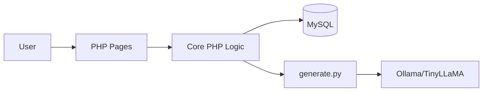

# TinyTales - AI Story Generator

[](./LICENSE)
[](#tech-stack)
[](#tech-stack)

TinyTales is an AI-powered storytelling platform where users generate custom stories by prompt, genre, and length, then review, store, and export stories through a web dashboard.

## Problem Statement

Most AI story tools are one-off prompt boxes with poor organization, no account-level history, and weak export/sharing support. TinyTales solves this by combining narrative generation with user profile, story management, and export workflows.

## Solution Overview

- PHP web app for auth, dashboard, profile, and story management
- Python generation service (`generate.py`) connected to local Ollama/TinyLLaMA
- MySQL persistence for users, stories, and preferences
- Export and upload handling for practical product-like behavior

## Architecture



## Tech Stack

- **Frontend**: PHP-rendered UI, CSS
- **Backend**: PHP (PDO, sessions)
- **AI Layer**: Python (`requests`) + Ollama API
- **Database**: MySQL
- **Runtime**: XAMPP + Python 3

## Features

- Prompt-based AI story generation
- Genre and word-count controls
- User authentication and personal dashboard
- Story history and management
- Export support (TXT/PDF)
- User profile and preferences

## Project Structure

```text
tinytales/
  index.php
  includes/
    config.php
    exports/
  public/
    auth.php
    dashboard.php
    stories.php
    story.php
    profile.php
  generate.py
  docs/
    schema.sql
    DEPLOYMENT.md
    API.md
    SECURITY.md
  tests/
    README.md
```

## Screenshots

Store screenshots in `docs/screenshots/`:
- `home.png`
- `dashboard.png`
- `story-generator.png`
- `story-view.png`

## Demo

- **Live URL**: `https://<your-demo-url>`
- **Demo GIF**: `docs/screenshots/demo.gif`


